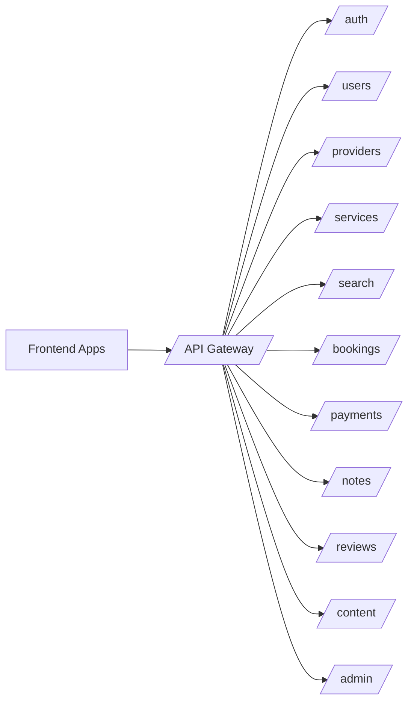

# Backend Architecture

## Approach

**MVP**: Supabase (PostgreSQL + Edge Functions + Auth + Storage + Realtime).  
**Scale**: Modular services via NestJS with PostgreSQL, Redis, and Algolia.

The BFF (Backend for Frontend) pattern means each client app (Parent, Provider, Admin) ideally has its own API surface, preventing over-fetching and enforcing tight RBAC.

---

## Services Breakdown

### A. Auth Service
- Parent, Provider, Admin authentication
- OTP login (phone), email/password, Google OAuth
- JWT session tokens
- Role-based access control (RBAC)
- **Supabase Auth** for MVP

### B. User & Profile Service
- User records (unified across roles)
- Child profiles (parent-linked)
- Provider profiles (linked to user, includes verification status)
- Provider categories (Partner / Independent / Royale)
- Service areas and languages

### C. CMS Content Service
- Service pages (auto-generated from Services Engine data)
- FAQs, banners, category explanations
- Provider profile content blocks
- SEO metadata
- **Sanity or Strapi** for MVP

### D. Search & Discovery Service
- Provider listing by service, location, category
- Full-text search on name, bio, service tags
- Ranking algorithm (level + rating + response time)
- Filters: service, location, experience, price, mode, language, gender, availability, age group, verified status
- **PostgreSQL FTS (MVP)** → **Algolia (scale)**

### E. Booking Service
- Slot generation and availability conflict checking
- Booking lifecycle state machine: `DRAFT → PENDING_PAYMENT → CONFIRMED → COMPLETED | CANCELLED | RESCHEDULED`
- Online/offline session type
- Calendar sync hooks
- Reschedule and cancellation workflows
- No-show handling

### F. Payment Service
- Razorpay order creation
- Webhook listener for `payment.captured`, `payment.failed`
- Booking confirmation after verified payment
- Receipts / invoices
- Refund initiation (admin only via Edge Function)
- Payout eligibility events

### G. Session Notes Service
- `PUBLIC` notes: visible to parent, provider, admin
- `PRIVATE` notes: visible only to provider (own sessions) and admin
- Strict RLS enforcement — application checks are supplementary
- Attachment/report storage
- Audit log per note action
- 48-hour submission nudge

### H. Notification Service
- Event-driven — receives events from booking/payment/notes queue
- Channels: WhatsApp API, Email (Resend/SendGrid), Push (FCM)
- Templates per event type
- Retry strategy for failed deliveries

### I. Reviews Service
- Post-session rating (1–5 stars)
- Review text with admin moderation flag
- Average score aggregation per provider
- Review request trigger after session completion

### J. Admin Workflow Service
- Provider approval queue and decision
- Category assignment
- Dispute resolution workflow
- Flags and moderation
- Payout reconciliation triggers

---

## Booking State Machine

```
DRAFT
  └→ PENDING_PAYMENT    (booking created, payment initiated)
        └→ CONFIRMED    (payment.captured webhook received)
              ├→ COMPLETED      (session done, notes submitted)
              ├→ CANCELLED      (either party cancels)
              └→ RESCHEDULED    (new slot confirmed)
```

**Rule**: Booking must stay `PENDING_PAYMENT` until Razorpay webhook fires `payment.captured`. Client-side success callbacks alone are not sufficient.

---

## Payment Flow

```
1. Client clicks "Pay & Confirm"
2. Backend creates Razorpay order → returns order_id
3. Client opens Razorpay checkout with order_id
4. User completes payment
5. Razorpay fires webhook to /api/webhooks/razorpay
6. Backend verifies signature
7. Backend marks booking as CONFIRMED
8. Booking confirmed event emitted → notifications dispatched
```

---

## API Module Map



---

## Event Queue

Events published to the queue drive notifications and analytics:

| Event | Published By | Consumed By |
|---|---|---|
| `booking.created` | Booking Service | Notification Service |
| `payment.success` | Payment Service | Booking Service, Notification Service |
| `booking.confirmed` | Booking Service | Notification Service, Analytics |
| `booking.cancelled` | Booking Service | Notification Service, Analytics |
| `session.completed` | Booking Service | Notes Service, Reviews Service, Notification Service |
| `notes.published` | Notes Service | Notification Service |
| `review.submitted` | Reviews Service | Admin Service, Analytics |

---

## Security

- **RLS on every table** — enforced at PostgreSQL level
- **JWT verification** on every Edge Function
- **Webhook signature verification** for Razorpay callbacks
- **Audit logs** for every critical action (booking changes, notes, approvals)
- **No direct DB access** from client — all queries via typed service layer

---

## MVP vs Scale

| Area | MVP | Scale |
|---|---|---|
| Backend | Supabase Edge Functions | NestJS microservices |
| Search | PostgreSQL FTS | Algolia / OpenSearch |
| Queue | Supabase Queues | BullMQ / Trigger.dev |
| Cache | None / minimal | Redis |
| Video | Google Meet link | WebRTC / Zoom SDK |
| Analytics | PostHog | Custom DW pipeline |
