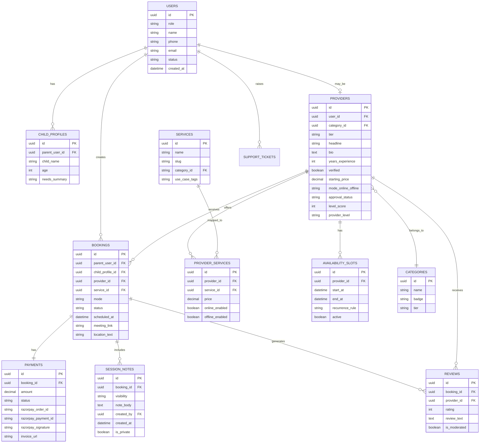

# Data Models

## Core Entity Relationships



---

## Table Definitions

### `users`
| Column | Type | Notes |
|---|---|---|
| `id` | `uuid` | Primary key |
| `role` | `enum('parent', 'provider', 'admin')` | First-class role |
| `name` | `text` | |
| `phone` | `text` | Unique |
| `email` | `text` | Unique |
| `status` | `enum('active', 'suspended', 'pending')` | |
| `created_at` | `timestamptz` | |

### `child_profiles`
| Column | Type | Notes |
|---|---|---|
| `id` | `uuid` | |
| `parent_user_id` | `uuid` | FK → `users.id` |
| `child_name` | `text` | |
| `age` | `int` | |
| `needs_summary` | `text` | Parent-written description |

### `categories`
| Column | Type | Notes |
|---|---|---|
| `id` | `uuid` | |
| `name` | `text` | e.g., "Counselling" |
| `badge` | `text` | Display badge label |
| `tier` | `enum('partner', 'independent', 'royale')` | Provider tier association |

### `providers`
| Column | Type | Notes |
|---|---|---|
| `id` | `uuid` | |
| `user_id` | `uuid` | FK → `users.id` |
| `category_id` | `uuid` | FK → `categories.id` |
| `tier` | `enum('partner', 'independent', 'royale')` | First-class field |
| `headline` | `text` | Short tagline |
| `bio` | `text` | |
| `years_experience` | `int` | |
| `verified` | `boolean` | Admin-set |
| `starting_price` | `numeric` | |
| `mode` | `enum('online', 'offline', 'both')` | |
| `approval_status` | `enum('pending', 'approved', 'rejected', 'suspended')` | |
| `provider_level` | `enum('starter', 'growing', 'pro', 'elite', 'royale')` | Gamification |
| `level_score` | `int` | Computed server-side |

### `services`
| Column | Type | Notes |
|---|---|---|
| `id` | `uuid` | |
| `name` | `text` | e.g., "ADHD Support" |
| `slug` | `text` | URL-safe |
| `parent_category` | `text` | Level 1 category |
| `use_case_tags` | `text[]` | Array of use-case phrases |

### `bookings`
| Column | Type | Notes |
|---|---|---|
| `id` | `uuid` | |
| `parent_user_id` | `uuid` | |
| `child_profile_id` | `uuid` | |
| `provider_id` | `uuid` | |
| `service_id` | `uuid` | |
| `mode` | `enum('online', 'offline')` | |
| `status` | `enum('draft', 'pending_payment', 'confirmed', 'completed', 'cancelled', 'rescheduled')` | |
| `scheduled_at` | `timestamptz` | |
| `meeting_link` | `text` | For online sessions |
| `location_text` | `text` | For offline sessions |

### `payments`
| Column | Type | Notes |
|---|---|---|
| `id` | `uuid` | |
| `booking_id` | `uuid` | |
| `amount` | `numeric` | |
| `status` | `enum('pending', 'captured', 'failed', 'refunded')` | |
| `razorpay_order_id` | `text` | |
| `razorpay_payment_id` | `text` | |
| `razorpay_signature` | `text` | |
| `invoice_url` | `text` | |

### `session_notes`
| Column | Type | Notes |
|---|---|---|
| `id` | `uuid` | |
| `booking_id` | `uuid` | |
| `is_private` | `boolean` | `true` = provider/admin only |
| `note_body` | `text` | |
| `created_by` | `uuid` | FK → `users.id` |
| `created_at` | `timestamptz` | |

**RLS Policy**: `is_private = false` → all roles. `is_private = true` → provider (own sessions) + admin only.

### `reviews`
| Column | Type | Notes |
|---|---|---|
| `id` | `uuid` | |
| `booking_id` | `uuid` | |
| `provider_id` | `uuid` | |
| `rating` | `int` | 1–5 |
| `review_text` | `text` | |
| `is_moderated` | `boolean` | Admin-set |

---

## Gamification Score Computation

Provider level is computed server-side (never on client):

```
level_score = (sessions_completed × 10)
            + (avg_rating × 20)
            + (retention_rate × 15)
            + (notes_completion_rate × 10)
            - (cancellation_count × 5)
```

| Score Range | Level |
|---|---|
| 0–99 | Starter |
| 100–249 | Growing |
| 250–499 | Pro |
| 500–999 | Elite |
| 1000+ | Royale |
