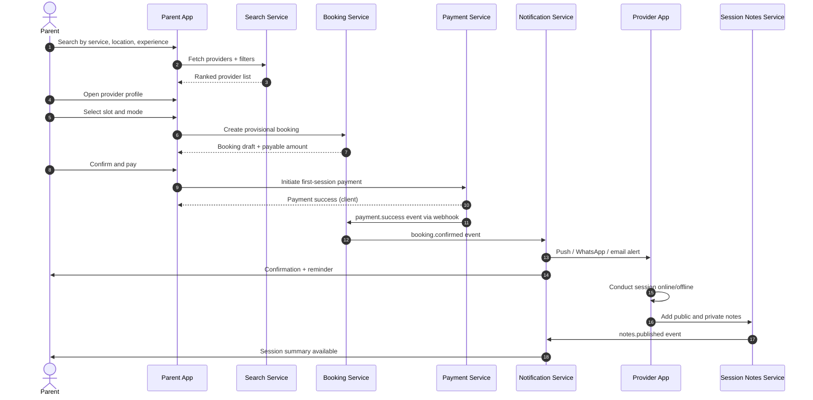
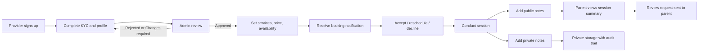
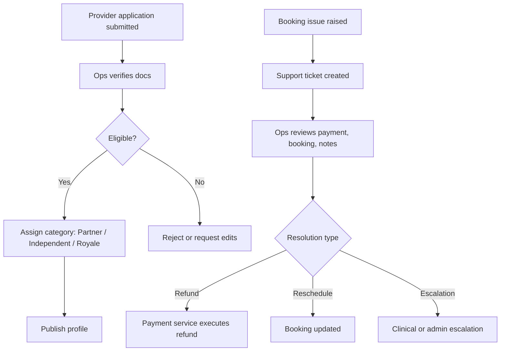

# Event Flows

## Architecture Principle
All critical events are published to an event queue. Notifications, analytics, and secondary service updates are triggered by consuming these events — they are **never hardcoded inside booking or payment logic**.

---

## Core Event Map

| Event | Published By | Consumed By |
|---|---|---|
| `booking.created` | Booking Service | Notification Service, Analytics |
| `payment.initiated` | Payment Service | Analytics |
| `payment.success` | Payment Service (webhook) | Booking Service, Notification Service |
| `payment.failed` | Payment Service (webhook) | Notification Service |
| `booking.confirmed` | Booking Service | Notification Service, Analytics |
| `booking.cancelled` | Booking Service | Notification Service, Analytics |
| `booking.rescheduled` | Booking Service | Notification Service, Analytics |
| `session.completed` | Booking Service | Notes Service, Reviews Service, Notification Service |
| `notes.published` | Notes Service | Notification Service |
| `review.submitted` | Reviews Service | Admin Service, Analytics |
| `provider.approved` | Admin Service | Notification Service |
| `refund.processed` | Payment Service | Notification Service, Analytics |

---

## End-to-End Parent Booking Flow



---

## Provider Onboarding Flow



---

## Admin Ops Flow



---

## Notification Channel Strategy

| Event | Channel | Recipient |
|---|---|---|
| `booking.confirmed` | WhatsApp + Email | Parent, Provider |
| `booking.cancelled` | WhatsApp + Email | Parent, Provider |
| `booking.rescheduled` | WhatsApp | Parent |
| `payment.failed` | Email + Push | Parent |
| `session.completed` | Push | Parent (review prompt) |
| `notes.published` | Push + Email | Parent |
| `provider.approved` | Email | Provider |
| `refund.processed` | Email | Parent |

---

## Notes Visibility Flow

```
Provider writes note
    ├── is_private = false → visible to Parent, Provider, Admin
    └── is_private = true  → visible to Provider (own) + Admin only

RLS enforced at DB level:
    SELECT * FROM session_notes
    WHERE booking_id = :id
      AND (is_private = false
           OR (auth.uid() = provider_user_id)
           OR (auth.role() = 'admin'))
```

---

## Reminder / Nudge Events

| Trigger | Timing | Action |
|---|---|---|
| Session starts in 24h | -24h from `scheduled_at` | Push to parent + provider |
| Session starts in 1h | -1h from `scheduled_at` | WhatsApp to parent |
| Notes not submitted | +48h after `session.completed` | Nudge to provider |
| Review not submitted | +72h after `session.completed` | Nudge to parent |
