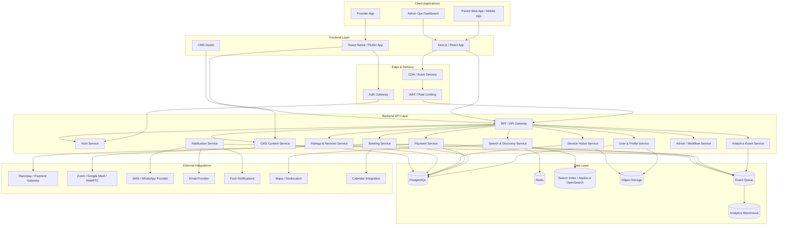

# System Architecture

## Overview

Insighte is a marketplace-style care platform. The architecture is designed to support three distinct app audiences — Parent, Provider, and Admin — with a clean separation of concerns at every layer.

---

## High-Level Architecture

---

## Layer Responsibilities

### Edge & Delivery
- **CDN / Asset Delivery**: Static assets, images, Next.js ISR pages. Hosted on Vercel edge network.
- **WAF / Rate Limiting**: Protect against abuse, scraping, and DDoS. Applied before BFF.
- **Auth Gateway**: Token validation at the edge for mobile API calls.

### Backend API Layer (BFF)
A BFF (Backend for Frontend) pattern routes client requests to the appropriate service. In MVP, this is Supabase Edge Functions. At scale, this can migrate to NestJS.

| Service | Responsibility |
|---|---|
| Auth | OTP, Google login, JWT, RBAC |
| User & Profile | User records, child profiles, provider profiles |
| Search | Provider listing, filters, ranking, location |
| Booking | Slot management, booking lifecycle |
| Payment | Razorpay integration, invoices, refunds |
| Notes | Public/private notes, audit logs |
| Notification | Event-driven push/email/WhatsApp |
| Reviews | Post-session ratings, moderation |
| CMS | Service pages, banners, FAQs, SEO |
| Admin/Ops | Approvals, disputes, payouts |
| Analytics | Event ingestion, warehouse pipeline |

### Data Layer
| Store | Usage |
|---|---|
| PostgreSQL | Primary relational store (via Supabase) |
| Redis | Search result cache, session data |
| Search Index | Algolia/OpenSearch for provider discovery |
| Object Storage | Profile photos, note attachments, documents |
| Event Queue | Booking/payment events → notification triggers |
| Analytics DW | Event logs aggregated for reporting |

---

## MVP Stack

| Area | Technology |
|---|---|
| Frontend | Next.js 15 + TypeScript + Tailwind + shadcn/ui |
| Backend | Supabase (PostgreSQL + Edge Functions) |
| Auth | Supabase Auth (OTP + Google) |
| Storage | Supabase Storage |
| Search | PostgreSQL FTS with `tsvector` |
| Payments | Razorpay |
| Notifications | WhatsApp API + Resend (email) + FCM |
| Video | Google Meet link generation |
| CMS | Sanity or Strapi |
| Hosting | Vercel (frontend) + Supabase (backend) |
| Monitoring | Sentry + PostHog |

---

## Architecture Rules (Non-Negotiable)

1. **Public and private session notes are separate entities.** Visibility enforced at RLS level, not just application code.
2. **Booking stays `PENDING_PAYMENT` until Razorpay webhook confirms `payment.captured`.** Never trust client-side confirmation alone.
3. **Provider category is a first-class DB field**, not a text tag or enum.
4. **Provider CMS profile content** is editable via CMS. Operational fields (availability, pricing, approval status) live in the app DB.
5. **Notifications are event-driven** — decoupled from booking/payment logic via an event queue.
6. **Search reads are served from cache/index**, not raw relational queries.
7. **Every critical action generates an audit log entry.**
8. **RLS on every table.** No table is accessible without a valid policy.

---

## Build Order (Production Priority)

1. Auth and roles
2. Database schema and migrations
3. Provider profile CRUD
4. Search and filters
5. Booking engine
6. Payments (Razorpay)
7. Notifications (event-driven)
8. Session notes (public/private)
9. Parent and Provider dashboards
10. Admin dashboard
11. Analytics and polish
